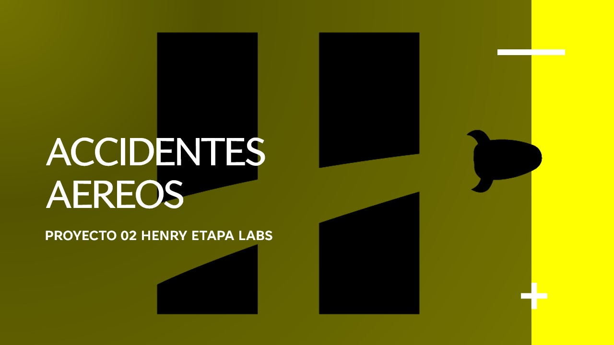

<h1 align=center> PROYECTO 02 HENRY ETAPA LABS </h1>

<h2> DESCRIPCION DEL REPOSITORIO </h2>

Este repositorio es parte del proyecto 02 de Data Analytics de la etapa labs de SoyHenry

El repositorio a la descripcion del proyecto se puede encontrar en: https://github.com/soyHenry/PI03-Analytics

Usted se encontrara con 4 carpetas, a saber: data, notebook, dashboard, src. A continuacion detallare cada una:

- data: esta carpeta contiene tanto la raw data, como la data transformada luego de procesos de ETL y feature engineer.
- notebook: contiene los notebooks que corresponden a los ETL y al EDA realizado.
- dashboard: contiene el archivo Introduccion.py y la carpeta pages, comprende la pagina web 
interactiva desarrollada con streamlit.
- src: es la carpeta que contiene las imagenes.

Por ultimo, *descripcion_columnas* es un archivo que describe
cada columnas del dataset utilizado.

<h2> PROPUESTA DE TRABAJO </h2>

<h3>CONTEXTO</h3>
Los accidentes aereos son eventos indeseados que producen grandes daños fisicos a personas, aeronaves, casas, terrenos, etc.
Por lo que es menester dedicar tiempo a entender cuales son las causalidades que originan estos eventos para mejorar la
seguridad aerea y prevenir futuros accidentes.

Trabajamos para la Organización de Aviación Civil Internacional (OACI). OACI es una organización intergubernamental que se 
dedica a promover la seguridad y eficiencia de la aviación civil internacional. 

Se nos proporciono datos de accidentes de aviones, pero la OACI nos insta a incluir y recopilar otras fuentes de datos.

El objetivo es hacer uso de las fuentes de datos recopiladas, analizarlas y visualizar los datos con el fin de detectar 
patrones, tendencias, estacionalidades que nos permitan desarrollar medidas preventivas con el fin de mejorar la 
seguridad aerea.

<h3> REQUERIMIENTOS DE APROBACION </h3>

#### `Análisis Exploratorio de los datos`
Se debe incluir un reporte que incluya un resumen de estadisticas descriptivas, analisis univariados, multivariados, y 
cualquier otro analisis que ayude al entendimiento del dataset.

#### `Dashboard`
El desarrollo de un dashboard funcional y cohorente con la historia que se vaya a contar.

#### `KPIs`
Se nos brinda un KPI, el cual se denomina tasa de mortalidad. A este, se le deben sugerir 3 KPIs adicionales, los 
deben aparecen el dashboard. Dichos KPIs deben tener relacion con la historia que se cuenta y se deben explicar en la 
presentacion.

#### `Análisis`
Se evaluara complementariamente al desarrollo del EDA, dashboard, etc. los analisis y conclusiones que se extraigan.

#### `Repositorio de GitHub`
Un repositorio en github con un README asociado.

<h2> SOLUCION PLANTEADA </h2>

### DATASET UTILIZADO

Se brindo un dataset de accidentes aereos por soyHenry. Sin embargo, se opto por el uso de un dataset complementario.

Se utilizo la base de datos de la organizacion **Aviation Safety Network (ASN)** que se encuentra en:
https://aviation-safety.net/database/

Puesto que no existe un csv en la misma pagina ni en otras fuentes, se le realizo un proceso de scraping para la 
obtencion de datos. El scraper se puede encontrar mas detallado en este repositorio: 
https://github.com/jcamatta/aviation_safety_network_data.

#### ELECCION DEL DATASET
Recomiendo personalmente, para futuros proyectos 02 relacionado con accidentes aereos, hacer uso del dataset resultante 
del proceso de scraping, puesto que:

1. Contiene las columnas del dataset original. Sin embargo, es 5 veces mas grande que el propuesto.
2. A traves de un proceso de feature engineer, se llego a construir un dataset con hasta 45 columnas.
3. Tiene asociado un documento que explicita el significado y los posibles valores de cada columna.

En resumen, con un conjunto de datos mayor, se puede desarrollar analisis mas complejos. Incluso se puede 
emplear modelos de Machine Learning con el objetivo de predecir, por ejemplo, numero de accidentes para un determinado 
año o cantidad de fallecidos segun el tipo de avion, etc.

Aunque es cierto que se pueden combinar ambos dataset, hay que señalar que el propuesto tiene un menor numero de 
columnas, por lo que quedarian el resto de las columnas con 5000 registros nulos al menos.

Por esta ultima, y las anteriores razones, se utilizo unicamente el dataset resultado del scraping.

#### CARACTERISTICAS DEL DATASET DE AVIATION SAFETY NETWORK
La raw data abarca desde el año 1919 hasta el presente año 2023. En concreto, el ultimo dato corresponde 
al 15 de mayo de 2023. Sin embargo, para produccion y analisis se corto hasta el año 2022 para tener estadisticas 
completas por año.

Como nombre anteriormente, el dataset final, este es, aquel llamado *asn_final_v3.csv* que se encuentra en la carpeta
*transform* en *data*. Contiene 45 columnas con 18162, luego de realizarles consecutivos procesos de transformacion. 
Este ultimo dataset se utiliza para el desarrollo del dashboard. 

Para el desarrollo del EDA se hizo uso del dataset que se denomina *asn_final_eda.csv*. La diferencia radica en que este 
ultimo no se le realizo imputacion de datos. La razon de esto que los valores faltantes intervenian en el desarrollo 
dashboard. Sin embargo, la imputacion realizada se justifica correctamente en el archivo *ASN_ETL_V3.ipynb*.

En el archivo *descripcion_columnas* se describe cada una de las 45 columnas del dataset final.

#### ETL
En la carpeta ETL dentro de la carpeta notebooks, se puede encontrar 3 notebooks que corresponden a 3 procesos de 
transformacion por los que paso el dataset de aviation safety network. La razon de la division es que cada uno implica
algo distinto y transformaciones "mas duras" que implican ciertas asunciones.

#### EDA
Se realizo un unico eda, que se encuentra dentro de la carpeta EDA en notebooks. El eda incluye un proceso de feature 
engineer, analisis temporal e historico, detencion de patrones, estudio de tendencia y estacionalidad, estadisticas 
descriptivas, analisis univariado, bivariado, y procesamiento de lenguaje natural.

#### DASHBOARD
El dashboard se desarrollo usando streamlit. Para hacer uso de el, deben clonar el repositorio, instalar las librerias 
necesarias, y ejecutar en la terminal el comando *streamlit run Introduccion.py*.

Contiene dos paginas, una introduccion que explica el proyecto y los KPIs que se utilizaron; y, la segunda pagina
que corresponde al dashboard interactivo donde se podran visualizar las metricas para cada pais, continente, o a nivel 
general con el objetivo de apreciar las diferencias a nivel local. 

#### LIBRERIAS UTILIZADAS:
- pandas
- numpy
- warnings
- pycountry_convert
- sklearn
- spacy
- matplotlib
- seaborn
- wordcloud
- collections
- datetime
- re
- geopy
- streamlit
- plotly

### RESUMEN BREVE DE LO OBSERVADO

Entre 1919 y 2022 ocurrieron un total de 19253 accidentes de los cuales 9707 (50%) provocaron al menos una muerte.

Se ha observado que a nivel general el numero de accidentes no disminuyo, sin embargo si se observa una caida en los 
ultimos años del numero de accidentes con victimas fatales. Por lo que se muestra que se estan realizando esfuerzos en 
la mejora de la seguridad aerea.

A nivel local, Estados Unidos es el pais con mayor numero de accidentes, seguido por Rusia y Brasil.

La razon principal de vuelo en la mayor parte de los accidentes es de indole militar. Le siguen aquellos que implican 
el traslado de pasajeros y de carga. Se destaca que en aquellos casos donde hubo victimas fatales, en la mayor parte de 
los casos, la aeronave quedo completamente destruida sin ninguna posibilidad de reparacion.

Mas alla de la tendencia decreciente a nivel general en los accidentes que involucran muertes, no se registro
ningun patron de estacionalidad a nivel trimestral, mensual, diario. Si, se observo que existe una diferencia 
significativa en el numero de accidentes que ocurren a la noche relativo a otras partes del dia.

